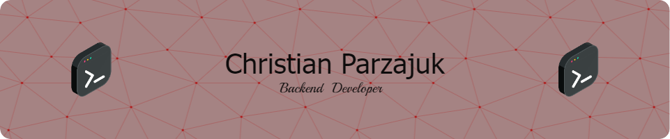

  # ¡Hola! Soy un Desarrollador Backend 🦀

  ### Rust | Node.js | Arquitectura de Software

  

    Construyo sistemas de alto rendimiento, seguros y escalables aplicando principios de <strong>Clean Code</strong> y <strong>SOLID</strong>.
  

  ---

  ### 🛠️ Tech Stack

  
  
  
  
   

  
  
  

   

  
  
  

---

### 🚀 Sobre mí

- 🔭 **Enfoque Actual:** Estoy migrando sistemas legacy y diseñando nuevas arquitecturas en **Rust**, aprovechando su seguridad de memoria y concurrencia.
- 📐 **Filosofía:** Me obsesiona la **arquitectura limpia**. Implemento patrones como **Repository Pattern** e **Inyección de Dependencias** para que el código sea mantenible a largo plazo.
- ⚡ **Performance:** Disfruto orquestando sistemas asíncronos (Workers/Queues) para asegurar que el usuario nunca tenga que esperar.

---

### 🚧 Proyectos Destacados

#### 🦀 SaaS Backend (Rust & Loco.rs)
Plataforma de gestión construida con una arquitectura modular y robusta.
- **Clean Architecture:** Separación estricta entre *Controllers*, *Services* y *Repositories*.
- **Background Workers:** Procesamiento asíncrono para notificaciones y webhooks.
- **Seguridad:** Autenticación JWT y validación de tipos estricta.

#### 🌍 E-commerce API (Microservicios)
API escalable diseñada para alta disponibilidad.
- **Optimización:** Consultas SQL complejas optimizadas para grandes volúmenes de datos.
- **Stack:** Node.js + TypeScript en transición a componentes de alto rendimiento.

---

### 💡 Intereses Técnicos

- **Rust & WebAssembly**
- **Domain-Driven Design (DDD)**
- **Sistemas Distribuidos y Concurrencia**
- **Optimización de bajo nivel**

---

  
✨ ¡Siempre abierto a colaborar en proyectos desafiantes donde la calidad del código sea la prioridad! ✨

  
  

